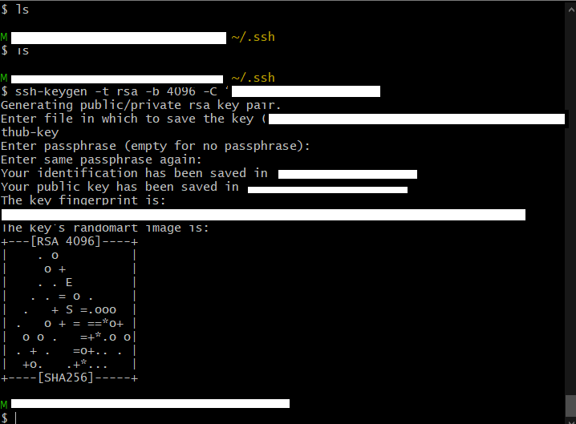
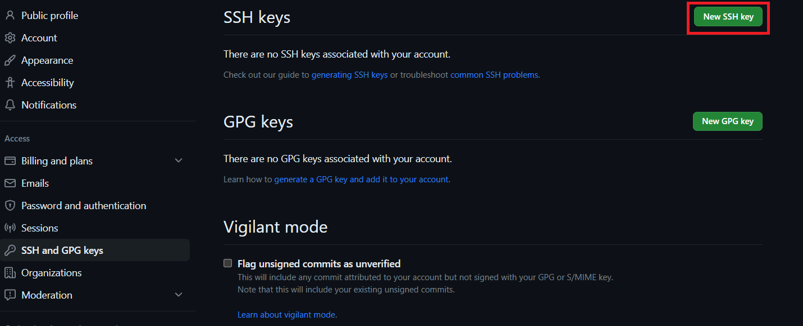
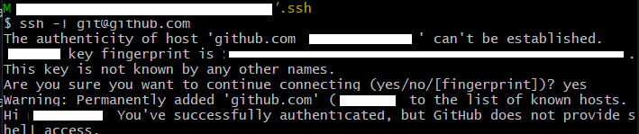
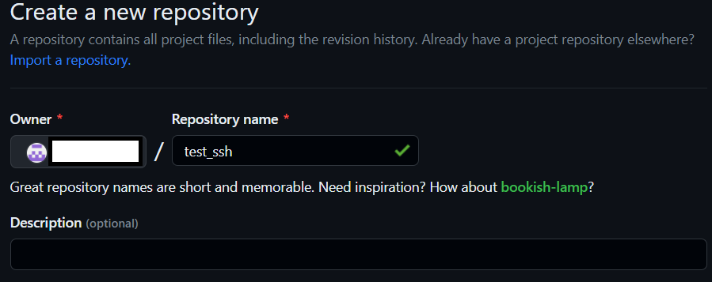
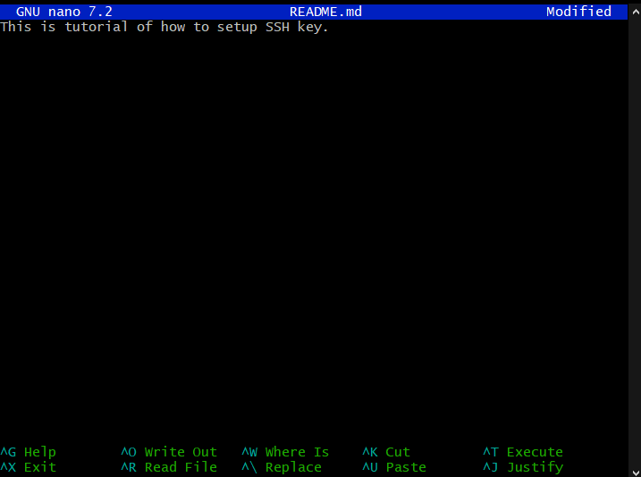
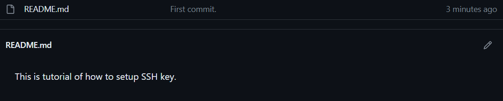

# This is tutorial of how to setup SSH key.

# 5 steps:
	1.Create an SSH key (local machine)
	2.Register the private key (GitHub - remote)
	3.Add private key to SSH register (local machine)
	4.Create a test repository (GitHub - remote)
	5.Use SSH to push changes to your test repository(from local to remote)

## STEP 1:
- Creating an SSH key (local machine):

`Commands (gitbash):`
-

`*cd (go to our main folder)`

`*mkdir .ssh (creating .ssh folder)`

`*ssh-keygen -t rsa -b 4096 -C "email"`

###### (where -t(type: rsa), -b(how long should be the key, bytes), -C(email address)
`creating name : name-github-key`

`enter`

`enter`
###### (if you want to delete wrong folder: rm name-github-key)

## STEP 2:
- Registering the public version of the key:

`Commands (gitbash):`
-
`cat name-github-key.pub (printing public key)`

##### Next (github)
`Settings -> SSH and GPG keys -> (press)New SSH key`

###### Title: name-github-key
###### Key type: Authentication Key

###### Key: (paste public key here starting with ssh-rsa and ending with your email)

###### (press) add new SSH key

## STEP 3:
- Adding a private key to local SSH register:

`Commands(gitbash):`
-

`eval `ssh-agent-s` (if it's the first time, we need to start SSH Agent first)`

`ssh-add name-mateusz-github-key (adding private key to register)`

`ssh -T git@github.com (checking connection, if asked: type 'yes)`

## STEP 4:
- Creating a test repo:
##### Next (github)
###### Create new repository 

###### Choose SSH: git@github.com:.../test_ssh.git

`Commands (gitbash):`
-

`cd "folder_name" (first move to the folder where you have other repositories)`

`mkdir test_ssh (make new directory test_ssh)`

`cd test_ssh (go into new folder)`

`touch README.md (create new folder README.md)`

`cat README.md (display README.md file)`

`nano README.md (opens up README.md editor)`

"Here we can type some random message"

`ctrl + s (save)`

`ctrl + x (to exit editor)`

`cat README.md (display README.md file)`

## STEP 5:
-Creating a new repository on the command line:

`Commands (gitbash):`
-
`git init (initializing local repo)`

`git add . (adding all the files)`

`git status (checking if all the files are tracked)`

`git commit -m "First commit"`

`git branch -M main (making sure that the branch name is main)`

`git remote add origin git@github.com:.../test_ssh.git (connecting local repo with remote repo through SSH address)`

`git push -u origin main (pushing all the files to remote repo)`

